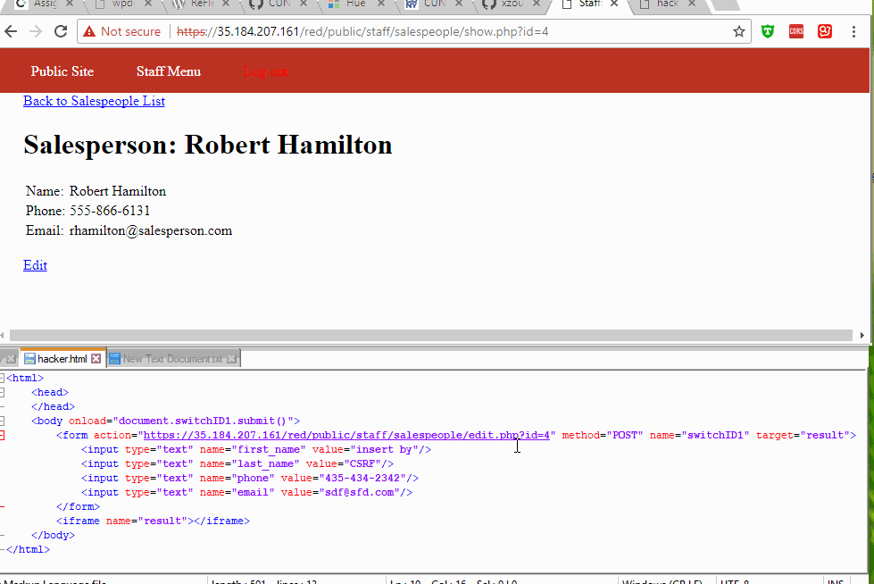

# Project 8 - Pentesting Live Targets

Time spent: **11** hours spent in total

> Objective: Identify vulnerabilities in three different versions of the Globitek website: blue, green, and red.

The six possible exploits are:
* Username Enumeration
* Insecure Direct Object Reference (IDOR)
* SQL Injection (SQLi)
* Cross-Site Scripting (XSS)
* Cross-Site Request Forgery (CSRF)
* Session Hijacking/Fixation

Each version of the site has been given two of the six vulnerabilities. (In other words, all six of the exploits should be assignable to one of the sites.)

## Blue

Vulnerability #1: SQL injection 

Vulnerability #2: Session Hijacking/Fixation 

## Green

Vulnerability #1: Cross-Site Scripting 

Vulnerability #2: Username Enumeration 

## Red

Vulnerability #1: Insecure Direct Object Reference 

Vulnerability #2: Cross-Site Request Forgery 

